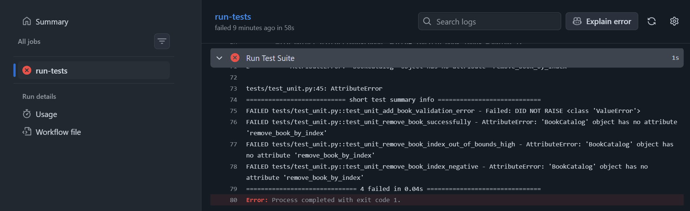

# LetterBookxd: A Book Management System

## App Description
LetterBookxd is an application designed for personal book collection management system. It allows users to maintain a digital catalog of their books by providing full CRUD (Create, Read, Update, Delete) functionality. The system focuses on simplicity and reliability, ensuring that book details such as titles and authors are correctly validated and persistently stored in-memory during the server's runtime.

## User Stories
1. As a reader, I want to add a new book with a title and author, so that I can keep track of my growing collection.
2. As a librarian, I want to view a list of all saved books, so that I can quickly see my inventory.
3. As a user, I want to remove a book from the list, so that my catalog stays accurate when I no longer own a copy.

## TechStack
- **Framework:** Python (Flask)

- **Testing Tools:** Pytest (Unit & Integration), Playwright (System/E2E)

- **Data Storage:** In-Memory Python List (Global State)

- **Deployment:** Render

- **CI/CD:** GitHub Actions

## Testing Strategy
This project follows the Red-Green-Refactor cycle at three distinct levels:

1. **Unit Testing:** We test the logic.py module in isolation. We focus on validation rules (e.g., preventing empty titles) and data formatting. This ensures our core business rules are foolproof before they ever touch the web.

2. **Integration Testing:** We test the Flask routes in app.py. We use the Flask Test Client to simulate HTTP requests (POST, GET, DELETE) to ensure the routes correctly communicate with the data layer and return the expected status codes.

3. **System Testing:** We perform full-browser automation using Playwright. These tests mirror our User Stories, ensuring that a real user can navigate the UI, fill out forms, and see changes reflected on the screen.

## CI/CD Setup
- **Tool:** GitHub Actions

- **Trigger:** All tests run automatically on every push to the main branch.

- **Evidence of TDD:** 
    - Red Phase: 
    - Green Phase: 

- **Deployment:** Automatic deployment to production occurs only if the full test suite passes.

## Setup Instructions
1. Clone the repository:

```bash
git clone https://github.com/Hiagyl/CMSC129-Lab4-TicotJ.git
cd python-tdd-lab
```

2. Create and activate a virtual environment:

```bash
python -m venv venv
# Windows:
.\venv\Scripts\activate
# Mac/Linux:
source venv/bin/activate
```

3. Install dependencies:

```bash
pip install -r requirements.txt
playwright install --with-deps
```

4. Run the application:

```bash
python app.py
```

5. Run tests:

```bash
pytest -s -v
```

 